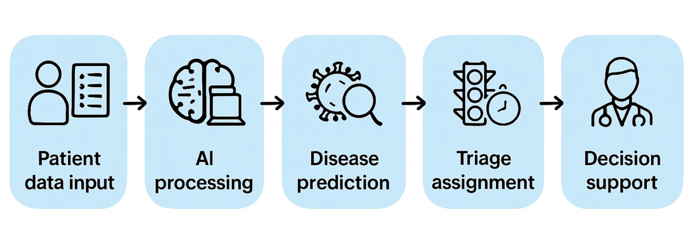

<h1 style="text-align: center;">Medisyn</h1>

  

## AI Powered Multi-Disease Triage System

## 🎞️ Presentation
[View Presentation](https://www.canva.com/design/DAG0197RZSQ/2IIWt_dbgO0tL2dqVg7F8w/view?utm_content=DAG0197RZSQ&utm_campaign=designshare&utm_medium=link2&utm_source=uniquelinks&utlId=h45d2caa289) 

# 🧩 Problem Statement
## "Overwhelmed Hospitals. Limited Resources. Critical Time Lost."
In today’s fast-paced healthcare system, emergency rooms are overcrowded, and critically ill patients often face long wait times. Hospitals in rural or low-resource areas struggle with limited supplies, beds, and specialist access. Traditional triage methods are slow, manual, and prone to errors, especially when symptoms are unclear or overlapping. As a result, patients with serious conditions may not be prioritized quickly, and doctors are forced to make rapid decisions with limited information.

# 🎯 Solution
## "Smarter Prioritization. Faster Response. Better Outcomes."
Medisyn is a real-time intelligent decision-support platform that analyzes symptoms and vital signs to instantly determine medical urgency—Low, Medium, or High. It helps healthcare professionals make faster, more accurate decisions with clear recommendations, optimizes hospital resource use, and ensures patients receive timely care based on urgency, improving overall healthcare outcomes.

---

# Features

- 🚦 Auto-assigns Low, Medium, or High urgency  
  (Low 🟢, Medium 🟡, High 🔴)  
- ⚖️ Built-In BMI Calculation for Health Context  
- 🩺 Smart Symptom Checker  
- 🔍 AI-Powered Disease Prediction  
- 📝 Dynamic Symptom Autocomplete  
- 💡 Provides Clear, Actionable Recommendations  
- ✅ Minimum Symptom Validation (3 Required for Accuracy)  
- 🗂️ User-Friendly Form with Tag-Based Symptom Selection  
- ⚡ Real-Time Processing & Fast Results  
- 📱 Responsive, Mobile-First Design

# Workflow

# 🛠️ Tech Stack
## Frontend

- **React.js** – For building a responsive and dynamic user interface  
- **Tailwind CSS** – Utility-first CSS framework for styling  
- **Framer Motion** – Animation library for smooth, interactive UI transitions  

## Backend

- **FastAPI (Python)** – High-performance API framework for backend services  
- **Uvicorn** – ASGI server for running FastAPI applications  

## AI/ML

- **Scikit-learn** – Machine learning library for model training and prediction  
- **Pandas** – Data manipulation and analysis  
- **NumPy** – Numerical computing and array operations  

## Data (Training/Testing)

- **CSV files** – Sourced from Kaggle datasets and simulated data 

## 🧠 Team - Capybara
Team Leader - Iqra Khan (Solo Participant) 

